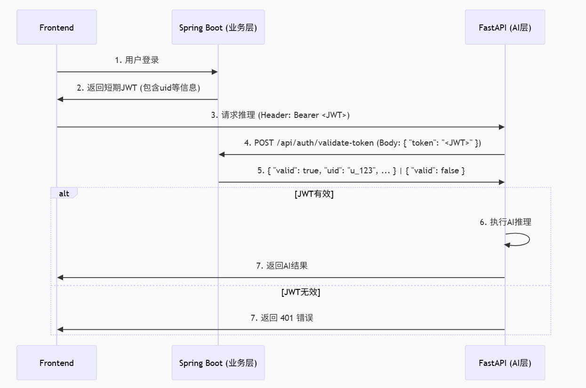

# 金融科技🤩

> 这个项目起源于睿抗的金融科技类赛项

此处为项目简介，和项目方向，接口请看API

## 功能介绍

1. **模块1**：分析交易数据是否异常

   1. 使用图神经网络来分析交易数据是否异常
   2. 检索相似数据来罗列历史交易数据，给用户一个参考

2. **模块2**：分析文本图片数据是否存在异常，是否存在欺诈消息

   1. (**AI**)取消项目之前的OCR转文字，采用多模态来识别文字
   2. (**前端，后台**)之前的项目对于图片的处理只能做到上传imageURL，现在需要做到能上传本地图片，经由springboot处理后传给Fast API，然后使用模型处理。

3. **模块3**：智能反诈助手

   1. (**后台,AI为主**)这一部分使用JWT实现用户验证，具体流程如下
   2. (**AI**)智能反诈助手这一部分需要**AI成员**使用llm来实现，现在又本地ollma或者API来实现
   3. (**前端**)不论是本地或是API，都采用流式输出的方式实现**前端**
   4. (AI)使用RAG实现特定领域效果增强

   ****

   1. (扩展)使用TTS实现语音合成，想要偷懒可以用硅基来实现，需要考虑答复的延迟

**不要偷懒谢谢喵**😛